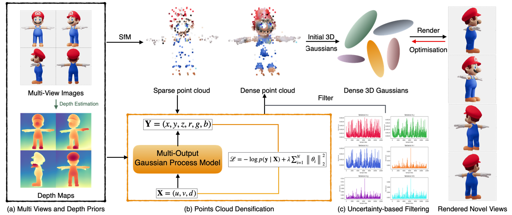

# GP-GS: Gaussian Processes for Enhanced 3D Gaussian Splatting


**This is the anonymous code repository for ICML2025 submission paper: GP-GS: Gaussian Processes for Enhanced 3D Gaussian Splatting **

## 😛 Abstract
3D Gaussian Splatting has emerged as an efficient photorealistic novel view synthesis method. However, its reliance on sparse Structure-from-Motion (SfM) point clouds consistently compromises the scene reconstruction quality. To address these limitations, this paper proposes a novel 3D reconstruction framework Gaussian Processes Gaussian Splatting (GP-GS), where a multi-output Gaussian Process model is developed to achieve adaptive and uncertainty-guided densification of sparse SfM point clouds. Specifically, we propose a dynamic sampling and filtering pipeline that adaptively expands the SfM point clouds by leveraging GP-based predictions to infer new candidate points from the input 2D pixels and depth maps. The pipeline utilizes uncertainty estimates to guide the pruning of high-variance predictions, ensuring geometric consistency and enabling the generation of dense point clouds. The densified point clouds provide high-quality initial 3D Gaussians to enhance reconstruction performance. Extensive experiments conducted on synthetic and real-world datasets across various scales validate the effectiveness and practicality of the proposed framework.
## 😊️ Pipeline



# GP-GS: Gaussian Processes for Enhanced Gaussian Splatting

## Overview
GP-GS is a novel framework that enhances the initialization of 3D Gaussian Splatting (3DGS) by leveraging Multi-Output Gaussian Processes (MOGP). It improves the rendering quality of novel view synthesis by densifying sparse point clouds reconstructed via Structure-from-Motion (SfM). The method is particularly effective in complex regions with densely packed objects and challenging lighting conditions.

## Pipeline
Our pipeline consists of the following steps:

1. **Multi-View Image Input**: We start with multi-view images and extract per-view depth maps using depth estimation models (e.g., Depth Anything).
2. **SfM Reconstruction**: Sparse point clouds are generated from the input images using Structure-from-Motion (SfM).
3. **Point Cloud Densification**: 
   - MOGP is trained to take pixel coordinates and depth values as input and predict dense 3D points with position and color information.
   - A Matérn kernel is used to model smooth spatial variations, and the parameters are optimized via gradient updates.
4. **Uncertainty-Based Filtering**:
   - High-variance noisy points are filtered out based on a variance-based thresholding strategy to ensure structured densification.
5. **Gaussian Initialization and Optimization**:
   - The densified points are used to initialize 3D Gaussians, which undergo further optimization to improve geometric accuracy.
6. **Novel View Rendering**:
   - The optimized 3D Gaussians are used for efficient rasterization-based rendering to synthesize high-quality novel views.
## Local setup
conda env create --file environment.yml
conda activate GP-GS
### Running
**MOGP**:
```shell
python MOGP/top_four_contribution.py #Find the image from a perspective that contributes most to SfM points cloud.
python MOGP/mogp_train.py #Training MOGP model
python MOGP/predict.py #Predict high quality dense points cloud.
```
**MOGP for 3D gaussians Initialization**:
```shell
python MOGP/rewrite_images_sfm.py
python MOGP/write_points3d.py
```
**3DGS***:
```shell
python train.py -s <scene path>
```
**Render and Evaluation**:
```shell
python render.py -m <model path>
python metrics.py -m <model path>
```


## 📚Citation
If you find this project useful in your research, please consider cite:
@article{guo2025gp,
  title={GP-GS: Gaussian Processes for Enhanced Gaussian Splatting},
  author={Guo, Zhihao and Su, Jingxuan and Wang, Shenglin and Fan, Jinlong and Zhang, Jing and Han, Liangxiu and Wang, Peng},
  journal={arXiv preprint arXiv:2502.02283},
  year={2025}
}


